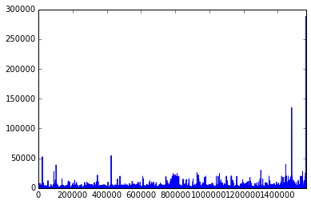

# Register of renewable energy power plants in Germany

This is a Jupyter Notebook that downloads and cleans up the data from the project [EnergyMap.info](http://www.energymap.info/) and  the German Federal Network Agency for Electricity, Gas, Telecommunications, Posts and Railway [BNetzA](http://www.bundesnetzagentur.de/). EnergyMap.info provides a register of all renewable energy power plants in Germany.

Since 2014 the BNetzA is responsible to publish the register of renewable power plants due to the [EEG 2014 (German)](http://www.gesetze-im-internet.de/eeg_2014/) [(English)](http://www.res-legal.eu/search-by-country/germany/single/s/res-e/t/promotion/aid/feed-in-tariff-eeg-feed-in-tariff/lastp/135/). Note: From June 2014 on all power plants are published in two seperated MS Excel-files for roof mounted PV systems and all other renewable power plants.

The register includes all RE power plants which are eligible for the German feed-in tariff (according to the EEG law). EnergyMap.info collects all data which is mandatorily reported from the four German TSO's to the BNetzA and merges it. Additionally EnergyMap.info validates and converts the data to a standard format.


# License

* This notebook is published under the GNU GPL v3 license. http://www.gnu.org/licenses/gpl-3.0.en.html.
* This notebook is developed by Wolf-Dieter Bunke [(E-Mail)](mailto:wolf-dieter.bunke@uni-flensburg.de)

# Table of contents 

* [Register of renewable energy power plants in Germany](#Register-of-renewable-energy-power-plants-in-Germany)
* [License](#Licence)
* [1. Import python modules](#1.-Import-python-modules)
     * [1.1 First Data overview of EnergyMap.info](#1.1-First-Data-overview-of-EnergyMap.info)
* ...
* [7 Documenting the data package in a JSON object](#7-Documenting-the-data-package-in-a-JSON-object)
* [8 Write Data Package to disk](#8-Write-Data-Package-to-disk)


# 1. Import Python modules


    import pandas as pd
    import numpy as np
    import zipfile
    import requests
    import io
    
    # Matplotlib
    %matplotlib inline


## 1.1 Data overview from EnergyMap.info

* Data discription from source: http://www.energymap.info/download/
* Download from: http://www.energymap.info/download/eeg_anlagenregister_2015.08.utf8.csv.zip
    * Last Dataset: 08.2015
    * Number of entries: 1.565.438 
    * File sides: 363,9 MB

##### Please note: Since the last change in the EEG law in 2014, three out of four German transmission network operators (TSO) stopped reporting

* **Report status by TSO:**
    * TenneT TSO GmbH:           still reporting, last reported entries 2015-08-17
    * 50Hertz Transmission GmbH: last report 2014-11-26
    * Amprion GmbH:              last report 2014-10-09
    * TransnetBW GmbH:           last report 2014-11-24

* **###### Concequence:** ???

## 1.2 Data overview from other data sources

German Federal Network Agency for Electricity, Gas, Telecommunications, Posts and Railway (BNetzA) renewable Power plant register ("Anlagenregister"): [PV](http://www.bundesnetzagentur.de/SharedDocs/Downloads/DE/Sachgebiete/Energie/Unternehmen_Institutionen/ErneuerbareEnergien/Photovoltaik/Datenmeldungen/Meldungen_Aug-Juni2015.xls?__blob=publicationFile&v=1) and [other renewables](http://www.bundesnetzagentur.de/SharedDocs/Downloads/DE/Sachgebiete/Energie/Unternehmen_Institutionen/ErneuerbareEnergien/Anlagenregister/VOeFF_Anlagenregister/2015-07_Veroeff_AnlReg.xls?__blob=publicationFile&v=1) renewable energy power plants, provided by the BNetzA.

* EUROSTAT
* [Netztransparenz](https://www.netztransparenz.de/de/Anlagenstammdaten.htm), Download: [zip-File](https://www.netztransparenz.de/de/file/UeNB-EEG-Anlagenstammdaten_2013.zip)
* German TSO's
    * 50Hertz
    * Amprion
    * TenneT
    * TransnetBW

# 2. Extracting data from EnergyMap.info

In the beginning we using EnergyMap.info for all historical data.

## 2.1 Download, unzip and load EnergyMap.info-CSV as data frame

We are creating a [pandas DataFrame](http://pandas.pydata.org/pandas-docs/stable/dsintro.html#dataframe) in order to handle our data.

--> Time for loading data: approx. 5-10 min.


    # Definint URL to energymap.info
    url_energymap = 'http://www.energymap.info/download/eeg_anlagenregister_2015.08.utf8.csv.zip'
    r = requests.get(url_energymap)
    z = zipfile.ZipFile(io.BytesIO(r.content))


    # Creating data frame from energyMap.info data
    # time: approx. 5-10 min
    eeg_data = pd.read_csv(z.open('eeg_anlagenregister_2015.08.utf8.csv'),
                               sep=';',
                               header=None,
                               names=None,
                               parse_dates=[0],
                               dayfirst=True,
                               comment='#',
                               low_memory = False)

## 2.2 Definition of column names

Here we translate the original column names from EnergyMap.info from German to English. The new English column names are assigned to our data frame.

Original Name|Translation|column name
-|-|-
Inbetriebnahmedatum|start-up date|start_up_date
GeoDBID| Geometry id | gid 
PLZ | post code or ZIP|postcode
Ort| name od city, vilage, municipality|	city
Strasse| street name and hous number|street_address
Anlagenschluessel| power plant indificator number|power_plant_id
Anlagentyp| Type of generation|	type_of_generation
Anlagenuntertyp| Sub type of generation|subtype
Nennleistung(kWp_el)| rated power |	rated_power
Einspeisespannungsebene| Type of grid connection, voltage level|voltage_level
DSO-EIC| Energy Identification Code (EIC) for distribution system operator (DSO) accounting area  |dso_eic
DSO| Name of distribution system operator|dso
TSO-EIC| Energy Identification Code (EIC) for transmission system operator (TSO)| tso_eic
TSO	| Name of TSO|tso
kWh(2013)| Annual power production of the year 2013| kwh2013
kWh(average)|Average power production|	kwh_avg
kWh/kW| Own calculation of EnergyMap of full-load hours |kwh_per_kw
EEG-Verguetungsschluessel|German EEG renumeration code	|eeg_renumeration_code
Gemeindeschluessel|	Municipality code of Germany | municipality_id
GPS-Lat| GPS Latetude coordinats| gps_lon
GPS-Lon| GPS Longetude coordinats|gps_lat
GPS-Genauigkeit(dm)| GPS accuracy of coordinats| gps_accuracy
Validierung| Data validation| validation


    # set new column names 
    eeg_data.columns = ['start_up_date', 'gid', 'postcode', 'city','street_address','power_plant_id',
                            'type_of_generation','subtype','rated_power','voltage_level','dso_eic','dso','tso_eic',
                            'tso','kwh2013','kwh_avg','kwh_per_kw','eeg_renumeration_code','municipality_id',
                            'gps_lon','gps_lat','gps_accuracy','validation']

## 2.3  First look at the data frame (structure and format)

Here we look at the created data frame and the data formats of the different columns:


    eeg_data.dtypes


    start_up_date            datetime64[ns]
    gid                             float64
    postcode                         object
    city                             object
    street_address                   object
    power_plant_id                   object
    type_of_generation               object
    subtype                          object
    rated_power                      object
    voltage_level                    object
    dso_eic                          object
    dso                              object
    tso_eic                         float64
    tso                              object
    kwh2013                          object
    kwh_avg                          object
    kwh_per_kw                      float64
    eeg_renumeration_code            object
    municipality_id                 float64
    gps_lon                          object
    gps_lat                          object
    gps_accuracy                    float64
    validation                       object
    dtype: object


Since "object"-types cannot be calculated they have to be converted to "float"-types.

### 2.3.1 Data type adjustment and first validation

We need to change the data type from "object" to "float" for the following columns:
* rated_power
* kwh2013
* kwh_avg
* gps_lon
* gps_lat

'#### Erklärender Satz zu Komma -> Punkt


    # replace comma with dots for gps_lon and lat
    eeg_data['gps_lon'] = eeg_data['gps_lon'].str.replace(',', '.')
    eeg_data['gps_lat'] = eeg_data['gps_lat'].str.replace(',', '.')


    # change data type from object to float 
    eeg_data['gps_lon'] = eeg_data['gps_lon'].astype('float64')
    eeg_data['gps_lat'] = eeg_data['gps_lat'].astype('float64')

Convert the record_id field from an integer to a float

```python
eeg_data['rated_power']  = eeg_data['rated_power'].astype('float64')
...
ValueError: could not convert string to float: '349,005'
# 1565437
```


    # take a look 
    eeg_data.head()


<div>
<table border="1" class="dataframe">
  <thead>
    <tr style="text-align: right;">
      <th></th>
      <th>start_up_date</th>
      <th>gid</th>
      <th>postcode</th>
      <th>city</th>
      <th>street_address</th>
      <th>power_plant_id</th>
      <th>type_of_generation</th>
      <th>subtype</th>
      <th>rated_power</th>
      <th>voltage_level</th>
      <th>...</th>
      <th>tso</th>
      <th>kwh2013</th>
      <th>kwh_avg</th>
      <th>kwh_per_kw</th>
      <th>eeg_renumeration_code</th>
      <th>municipality_id</th>
      <th>gps_lon</th>
      <th>gps_lat</th>
      <th>gps_accuracy</th>
      <th>validation</th>
    </tr>
  </thead>
  <tbody>
    <tr>
      <th>0</th>
      <td>1994-03-25</td>
      <td>13790</td>
      <td>79280</td>
      <td>Au</td>
      <td>NaN</td>
      <td>E10775011000000000000015114900001</td>
      <td>Solarstrom</td>
      <td>Freifläche</td>
      <td>3</td>
      <td>07 (NS)</td>
      <td>...</td>
      <td>TransnetBW GmbH</td>
      <td>NaN</td>
      <td>1.676,833</td>
      <td>558.000</td>
      <td>SoK81a------01</td>
      <td>8315003</td>
      <td>47.95</td>
      <td>7.833</td>
      <td>30000</td>
      <td>OK</td>
    </tr>
    <tr>
      <th>1</th>
      <td>1994-06-30</td>
      <td>13790</td>
      <td>79280</td>
      <td>Au</td>
      <td>NaN</td>
      <td>E10775011000000000000000001500001</td>
      <td>Solarstrom</td>
      <td>Freifläche</td>
      <td>3</td>
      <td>07 (NS)</td>
      <td>...</td>
      <td>TransnetBW GmbH</td>
      <td>1.362</td>
      <td>1.515,714</td>
      <td>505.000</td>
      <td>SoK81a------01</td>
      <td>8315003</td>
      <td>47.95</td>
      <td>7.833</td>
      <td>30000</td>
      <td>OK</td>
    </tr>
    <tr>
      <th>2</th>
      <td>1994-09-19</td>
      <td>13790</td>
      <td>79280</td>
      <td>Au</td>
      <td>NaN</td>
      <td>E10775011000000000000015116700001</td>
      <td>Solarstrom</td>
      <td>Freifläche</td>
      <td>3</td>
      <td>07 (NS)</td>
      <td>...</td>
      <td>TransnetBW GmbH</td>
      <td>852</td>
      <td>1.064,571</td>
      <td>354.000</td>
      <td>SoK81a------01</td>
      <td>8315003</td>
      <td>47.95</td>
      <td>7.833</td>
      <td>30000</td>
      <td>?(kWh/kW),</td>
    </tr>
    <tr>
      <th>3</th>
      <td>1996-05-07</td>
      <td>13790</td>
      <td>79280</td>
      <td>Au</td>
      <td>NaN</td>
      <td>E10775011000000000000015116600001</td>
      <td>Solarstrom</td>
      <td>Freifläche</td>
      <td>3</td>
      <td>07 (NS)</td>
      <td>...</td>
      <td>TransnetBW GmbH</td>
      <td>1.894</td>
      <td>4.746,143</td>
      <td>1.582</td>
      <td>SoK81a------01</td>
      <td>8315003</td>
      <td>47.95</td>
      <td>7.833</td>
      <td>30000</td>
      <td>?(kWh/kW),</td>
    </tr>
    <tr>
      <th>4</th>
      <td>2001-04-23</td>
      <td>13790</td>
      <td>79280</td>
      <td>Au</td>
      <td>NaN</td>
      <td>E10775011000000000000000029500001</td>
      <td>Solarstrom</td>
      <td>Freifläche</td>
      <td>2</td>
      <td>07 (NS)</td>
      <td>...</td>
      <td>TransnetBW GmbH</td>
      <td>1.648</td>
      <td>1.819</td>
      <td>909.000</td>
      <td>SoK81a------01</td>
      <td>8315003</td>
      <td>47.95</td>
      <td>7.833</td>
      <td>30000</td>
      <td>OK</td>
    </tr>
  </tbody>
</table>
<p>5 rows × 23 columns</p>
</div>


    eeg_data.tail()


<div>
<table border="1" class="dataframe">
  <thead>
    <tr style="text-align: right;">
      <th></th>
      <th>start_up_date</th>
      <th>gid</th>
      <th>postcode</th>
      <th>city</th>
      <th>street_address</th>
      <th>power_plant_id</th>
      <th>type_of_generation</th>
      <th>subtype</th>
      <th>rated_power</th>
      <th>voltage_level</th>
      <th>...</th>
      <th>tso</th>
      <th>kwh2013</th>
      <th>kwh_avg</th>
      <th>kwh_per_kw</th>
      <th>eeg_renumeration_code</th>
      <th>municipality_id</th>
      <th>gps_lon</th>
      <th>gps_lat</th>
      <th>gps_accuracy</th>
      <th>validation</th>
    </tr>
  </thead>
  <tbody>
    <tr>
      <th>1565433</th>
      <td>2015-07-31</td>
      <td>NaN</td>
      <td>99999</td>
      <td>keine Angabe</td>
      <td>Noch nicht in Stammdaten</td>
      <td>E2056801-AGGREGATION-FIKTIV-BIOMA</td>
      <td>Biomasse</td>
      <td>NaN</td>
      <td>9.978,4</td>
      <td>05 (MS)</td>
      <td>...</td>
      <td>TenneT TSO GmbH</td>
      <td>NaN</td>
      <td>NaN</td>
      <td>0</td>
      <td>NaN</td>
      <td>NaN</td>
      <td>NaN</td>
      <td>NaN</td>
      <td>NaN</td>
      <td>?(PLZ),</td>
    </tr>
    <tr>
      <th>1565434</th>
      <td>2015-07-31</td>
      <td>NaN</td>
      <td>99999</td>
      <td>keine Angabe</td>
      <td>Noch nicht in Stammdaten</td>
      <td>E2056801-AGGREGATION-FIKTIV-SOLAR</td>
      <td>Solarstrom</td>
      <td>NaN</td>
      <td>7.598,642</td>
      <td>07 (NS)</td>
      <td>...</td>
      <td>TenneT TSO GmbH</td>
      <td>NaN</td>
      <td>NaN</td>
      <td>0</td>
      <td>NaN</td>
      <td>NaN</td>
      <td>NaN</td>
      <td>NaN</td>
      <td>NaN</td>
      <td>?(PLZ),</td>
    </tr>
    <tr>
      <th>1565435</th>
      <td>2015-07-31</td>
      <td>NaN</td>
      <td>99999</td>
      <td>keine Angabe</td>
      <td>Noch nicht in Stammdaten</td>
      <td>E2056801-AGGREGATION-FIKTIV-WASSE</td>
      <td>Wasserkraft</td>
      <td>NaN</td>
      <td>886,5</td>
      <td>07 (NS)</td>
      <td>...</td>
      <td>TenneT TSO GmbH</td>
      <td>NaN</td>
      <td>NaN</td>
      <td>0</td>
      <td>NaN</td>
      <td>NaN</td>
      <td>NaN</td>
      <td>NaN</td>
      <td>NaN</td>
      <td>?(PLZ),</td>
    </tr>
    <tr>
      <th>1565436</th>
      <td>2015-07-31</td>
      <td>NaN</td>
      <td>99999</td>
      <td>keine Angabe</td>
      <td>Noch nicht in Stammdaten</td>
      <td>E2056801-AGGREGATION-FIKTIV-WIND-</td>
      <td>Windkraft</td>
      <td>NaN</td>
      <td>12.142,76</td>
      <td>05 (MS)</td>
      <td>...</td>
      <td>TenneT TSO GmbH</td>
      <td>NaN</td>
      <td>NaN</td>
      <td>0</td>
      <td>NaN</td>
      <td>NaN</td>
      <td>NaN</td>
      <td>NaN</td>
      <td>NaN</td>
      <td>?(PLZ),?(SpE 7 vs. 13047 kW),</td>
    </tr>
    <tr>
      <th>1565437</th>
      <td>2015-07-31</td>
      <td>NaN</td>
      <td>99999</td>
      <td>keine Angabe</td>
      <td>Noch nicht in Stammdaten erfasst</td>
      <td>E2301301-AGGREGATION-FIKTIV-Solar</td>
      <td>Solarstrom</td>
      <td>NaN</td>
      <td>349,005</td>
      <td>07 (NS)</td>
      <td>...</td>
      <td>TenneT TSO GmbH</td>
      <td>NaN</td>
      <td>NaN</td>
      <td>0</td>
      <td>NaN</td>
      <td>NaN</td>
      <td>NaN</td>
      <td>NaN</td>
      <td>NaN</td>
      <td>?(PLZ),?(SpE 7 vs. 282 kW),</td>
    </tr>
  </tbody>
</table>
<p>5 rows × 23 columns</p>
</div>


### 2.3.2 Delete data entires which are not part of the register
    (i.e. obviously wrong)


    # delete rows where postcode is like 99999
    eeg_data = eeg_data.drop(eeg_data[eeg_data['postcode'].str.contains("99999")].index)


    # replace dots and change comma into dots
    eeg_data['rated_power'] = eeg_data['rated_power'].str.replace('.', '')
    eeg_data['rated_power'] = eeg_data['rated_power'].str.replace(',', '.')


    # change type
    eeg_data['rated_power'] = eeg_data['rated_power'].astype('float64')


    # sum in Gigawatt 
    eeg_data['rated_power'].sum()/1000000


    88.3717318079947


    # sum in Gigawatt with validation OK
    eeg_data[eeg_data['validation']=='OK'].sum()['rated_power']/1000000


    73.677274531002027


    eeg_data['rated_power'].describe()


    count    1560347.000000
    mean          56.635948
    std          519.416880
    min            0.000000
    25%            5.540000
    50%            9.240000
    75%           19.500000
    max       288000.000000
    Name: rated_power, dtype: float64


    # group by type in MW
    eeg_data.groupby(['type_of_generation'])['rated_power'].sum()/1000


    type_of_generation
    Biomasse        7033.302073
    Erdwärme          33.643000
    Gas              630.166040
    Solarstrom     37108.875856
    Wasserkraft     1643.631559
    Windkraft      41922.113280
    Name: rated_power, dtype: float64


    eeg_data.groupby(['start_up_date'])['rated_power'].sum()/1000


    start_up_date
    1895-11-16      0.070000
    1898-07-01      0.400000
    1899-11-01      0.264000
    1899-12-30      0.796000
    1899-12-31      0.490000
    1900-01-01      2.656000
    1900-10-01      1.200000
    1901-01-01      0.013000
    1901-07-01      0.044000
    1901-11-01      0.080000
    1901-12-31      0.880000
    1903-01-01      0.008000
    1904-01-01      0.121000
    1905-01-01      1.560000
    1905-03-14      0.055000
    1905-04-11      0.700000
    1905-04-15      1.200000
    1905-04-16      0.800000
    1905-04-19      0.040000
    1905-04-22      0.400000
    1905-05-08      0.560000
    1905-05-09      0.400000
    1905-06-25      0.056000
    1905-06-26      0.090000
    1905-06-27      1.053000
    1906-01-01      0.662000
    1906-09-01      0.080000
    1907-01-01      1.652200
    1907-06-01      0.060000
    1907-12-31      0.767000
                     ...    
    2015-07-31      0.105480
    2015-08-01    138.250000
    2015-08-04      6.155040
    2015-08-05      9.231210
    2015-08-06      0.004800
    2015-08-07      0.010140
    2015-08-08      0.012680
    2015-08-10      0.029835
    2015-08-11     15.041820
    2015-08-12      0.020575
    2015-08-13      0.004160
    2015-08-17      0.004680
    2017-06-01      0.420000
    2018-06-18      0.490000
    2022-01-07      0.230000
    2022-07-01      0.370000
    2023-04-14      0.600000
    2025-02-09      0.014000
    2027-07-15      0.137000
    2028-08-10      0.030000
    2029-10-01      0.058000
    2030-03-12      4.000000
    2030-04-01      0.100000
    2032-05-12      0.017000
    2036-10-01      0.037000
    2037-04-01      0.048000
    2040-02-16      0.019500
    2043-02-14      0.007500
    2043-09-01      0.360000
    2046-09-27      0.386000
    Name: rated_power, dtype: float64


    # remove dots
    eeg_data['kwh_avg'] = eeg_data['kwh_avg'].str.replace('.', '')
    eeg_data['kwh2013'] = eeg_data['kwh2013'].str.replace('.', '')


    # remove comma with dots
    eeg_data['kwh_avg'] = eeg_data['kwh_avg'].str.replace(',', '.')
    eeg_data['kwh2013'] = eeg_data['kwh2013'].str.replace(',', '.')


    # change type
    eeg_data['kwh_avg'] = eeg_data['kwh_avg'].astype('float64')
    eeg_data['kwh2013'] = eeg_data['kwh2013'].astype('float64')

### 2.3.3 Strange date

* ToDo:
     * e.g. 2046-09-27, 1895-11-16 
     * ...


##  2.4 Translation of type and subtype

### 2.4.1 types

type_of_generation| OPSD naming
-|-
Gas | gas
Erdwärme| geothermal
Wasserkraft| hydro
Windkraft|wind 
Biomasse|biomass 
Solarstrom| solar


    # replace names
    eeg_data['type_of_generation'] = eeg_data['type_of_generation'].str.replace('Gas', 'gas').replace('Erdwärme', 'geothermal').replace('Wasserkraft', 'hydro').replace('Windkraft', 'wind').replace('Biomasse', 'biomass').replace('Solarstrom', 'solar')
    # get an overview
    eeg_data.groupby(['type_of_generation'])['rated_power'].agg(['sum', 'count'])


<div>
<table border="1" class="dataframe">
  <thead>
    <tr style="text-align: right;">
      <th></th>
      <th>sum</th>
      <th>count</th>
    </tr>
    <tr>
      <th>type_of_generation</th>
      <th></th>
      <th></th>
    </tr>
  </thead>
  <tbody>
    <tr>
      <th>biomass</th>
      <td>7033302.073000</td>
      <td>15206</td>
    </tr>
    <tr>
      <th>gas</th>
      <td>630166.040000</td>
      <td>829</td>
    </tr>
    <tr>
      <th>geothermal</th>
      <td>33643.000000</td>
      <td>29</td>
    </tr>
    <tr>
      <th>hydro</th>
      <td>1643631.559000</td>
      <td>7459</td>
    </tr>
    <tr>
      <th>solar</th>
      <td>37108875.856003</td>
      <td>1512290</td>
    </tr>
    <tr>
      <th>wind</th>
      <td>41922113.280000</td>
      <td>24534</td>
    </tr>
  </tbody>
</table>
</div>


### 2.4.2 Subtypes

subtype| OPSD naming
-|-
Altholz|waste_wood 
Biogas|biogas 
Biogas (Gasnetzentnahme)|biogas_gas_grid 
Biogas (Trockenfermentation)|biogas_dry_fermentation
Biotreibstoffe|biofuel 
Deponiegas|landfill_gas 
Freifläche|ground_mounted 
Gebäude|roof_mounted 
Grubengas|mine_gas 
Holz| wood
Klärgas| sewage_gas
Offshore|offshore 
Onshore|onshore


    # replace names
    eeg_data['subtype'] = eeg_data['subtype'].str.replace('Onshore', 'onshore').replace('Offshore', 'offshore').replace('Klärgas', 'sewage_gas').replace('Holz', 'wood').replace('Grubengas', 'mine_gas').replace('Gebäude', 'roof_mounted').replace('Freifläche', 'ground_mounted').replace('Deponiegas', 'landfill_gas').replace('Biotreibstoffe', 'biofuel').replace('Biogas (Trockenfermentation)', 'biogas_dry_fermentation').replace('Altholz', 'waste_wood ').replace('Biogas (Gasnetzentnahme)', 'biogas_gas_grid').replace('Biogas', 'biogas')
    # get an overview
    eeg_data.groupby(['subtype'])['rated_power'].agg(['sum', 'count'])


<div>
<table border="1" class="dataframe">
  <thead>
    <tr style="text-align: right;">
      <th></th>
      <th>sum</th>
      <th>count</th>
    </tr>
    <tr>
      <th>subtype</th>
      <th></th>
      <th></th>
    </tr>
  </thead>
  <tbody>
    <tr>
      <th>biofuel</th>
      <td>117663.741000</td>
      <td>362</td>
    </tr>
    <tr>
      <th>biogas</th>
      <td>3955174.832000</td>
      <td>9577</td>
    </tr>
    <tr>
      <th>biogas_dry_fermentation</th>
      <td>38063.000000</td>
      <td>64</td>
    </tr>
    <tr>
      <th>biogas_gas_grid</th>
      <td>255955.120000</td>
      <td>867</td>
    </tr>
    <tr>
      <th>ground_mounted</th>
      <td>10367382.861000</td>
      <td>115305</td>
    </tr>
    <tr>
      <th>landfill_gas</th>
      <td>128535.120000</td>
      <td>239</td>
    </tr>
    <tr>
      <th>mine_gas</th>
      <td>291933.000000</td>
      <td>101</td>
    </tr>
    <tr>
      <th>offshore</th>
      <td>2373650.000000</td>
      <td>585</td>
    </tr>
    <tr>
      <th>onshore</th>
      <td>23408082.410000</td>
      <td>13716</td>
    </tr>
    <tr>
      <th>roof_mounted</th>
      <td>21029051.915004</td>
      <td>1016431</td>
    </tr>
    <tr>
      <th>sewage_gas</th>
      <td>90166.620000</td>
      <td>227</td>
    </tr>
    <tr>
      <th>waste_wood</th>
      <td>162734.000000</td>
      <td>9</td>
    </tr>
    <tr>
      <th>wood</th>
      <td>189662.600000</td>
      <td>48</td>
    </tr>
  </tbody>
</table>
</div>


## 2.5  Overview of the first result


    # plot 
    eeg_data['rated_power'].plot() 


    <matplotlib.axes._subplots.AxesSubplot at 0x7fcdc484c748>





## 2.6 Take a look into the statistics of BNetzA


    # get statistics  
    url_eeg2013 ='http://www.bundesnetzagentur.de/SharedDocs/Downloads/DE/Sachgebiete/Energie/Unternehmen_Institutionen/ErneuerbareEnergien/ZahlenDatenInformationen/EEGinZahlen_2013.xls;?__blob=publicationFile&v=3'
    eeg2013  =pd.ExcelFile(url_eeg2013)
    eeg2013.sheet_names


    ['Inhaltsverzeichnis',
     '1. Allgemeine Erläuterungen',
     '2.1 Überblick Deutschland',
     '2.2 Überblick Bundesländer',
     '2.3 Letzverbraucherabsatz',
     '2.4 Historische Entwicklung',
     '3.1 Wind onshore',
     '3.2 Wind offshore',
     '3.3 PV insgesamt',
     '3.4 PV Kategorien',
     '3.5 Biomasse',
     '3.6 Wasser',
     '3.7 Sonstige Energieträger',
     '4.1 Regelzonen',
     '4.2 Anschlussebenen',
     '4.3 Größenklassen',
     '5. Vermiedene NE']


    sta2013 = eeg2013.parse('2.1 Überblick Deutschland', skiprows=3, skip_footer=9)
    sta2013


<div>
<table border="1" class="dataframe">
  <thead>
    <tr style="text-align: right;">
      <th></th>
      <th>Angaben insgesamt 2013</th>
      <th>Erneuerbare Energieträger nach dem EEG</th>
      <th>Unnamed: 2</th>
      <th>Unnamed: 3</th>
      <th>Unnamed: 4</th>
      <th>Unnamed: 5</th>
      <th>Unnamed: 6</th>
      <th>Unnamed: 7</th>
      <th>Summe</th>
    </tr>
  </thead>
  <tbody>
    <tr>
      <th>0</th>
      <td>NaN</td>
      <td>Wasser</td>
      <td>DKG-Gas*</td>
      <td>Biomasse</td>
      <td>Geothermie</td>
      <td>Wind onshore</td>
      <td>Wind offshore</td>
      <td>Solar</td>
      <td>NaN</td>
    </tr>
    <tr>
      <th>1</th>
      <td>Installierte Leistung ingesamt (in MW)</td>
      <td>1487.23</td>
      <td>551.15</td>
      <td>6052.43</td>
      <td>30.485</td>
      <td>33456.7</td>
      <td>508.3</td>
      <td>36710.1</td>
      <td>78796.4</td>
    </tr>
    <tr>
      <th>2</th>
      <td>Neuinbetriebnahmen (in MW)</td>
      <td>76.0051</td>
      <td>0.658</td>
      <td>167.197</td>
      <td>11.315</td>
      <td>2900.46</td>
      <td>240</td>
      <td>2643.31</td>
      <td>6038.94</td>
    </tr>
    <tr>
      <th>3</th>
      <td>Installierte Anlagen insgesamt (Anzahl)</td>
      <td>6972</td>
      <td>686</td>
      <td>13420</td>
      <td>8</td>
      <td>22746</td>
      <td>113</td>
      <td>1429860</td>
      <td>1473805</td>
    </tr>
    <tr>
      <th>4</th>
      <td>Eingespeiste Jahresarbeit (GWh)</td>
      <td>6265.11</td>
      <td>1775.74</td>
      <td>36258.4</td>
      <td>79.8633</td>
      <td>50802.7</td>
      <td>904.818</td>
      <td>28785.1</td>
      <td>124872</td>
    </tr>
    <tr>
      <th>5</th>
      <td>Vergütungszahlungen (Mio.€)</td>
      <td>420.232</td>
      <td>48.1669</td>
      <td>6158.38</td>
      <td>18.6547</td>
      <td>3523.23</td>
      <td>122.603</td>
      <td>9346.04</td>
      <td>19637.3</td>
    </tr>
    <tr>
      <th>6</th>
      <td>NaN</td>
      <td>NaN</td>
      <td>NaN</td>
      <td>NaN</td>
      <td>NaN</td>
      <td>NaN</td>
      <td>NaN</td>
      <td>NaN</td>
      <td>NaN</td>
    </tr>
    <tr>
      <th>7</th>
      <td>Angaben nach Vergütungsarten 2013</td>
      <td>Erneuerbare Energieträger nach dem EEG</td>
      <td>NaN</td>
      <td>NaN</td>
      <td>NaN</td>
      <td>NaN</td>
      <td>NaN</td>
      <td>NaN</td>
      <td>Summe</td>
    </tr>
    <tr>
      <th>8</th>
      <td>NaN</td>
      <td>Wasser</td>
      <td>DKG-Gas*</td>
      <td>Biomasse</td>
      <td>Geothermie</td>
      <td>Wind onshore</td>
      <td>Wind offshore</td>
      <td>Solar</td>
      <td>NaN</td>
    </tr>
    <tr>
      <th>9</th>
      <td>Feste Einspeisevergütung nach § 16 EEG 2012</td>
      <td>NaN</td>
      <td>NaN</td>
      <td>NaN</td>
      <td>NaN</td>
      <td>NaN</td>
      <td>NaN</td>
      <td>NaN</td>
      <td>NaN</td>
    </tr>
  </tbody>
</table>
</div>


### TODO: 
* sum by year and type
* calc error of missing rated power e.g.
* ...

# 3 Get new data from BNetzA

* Introduction ...


## 3.1 Download BNetzA register #1

Note: Here dataset without roof-mounted PV systems. (For dataset of roof-mounted PV systems see [3.2](#Download-PV-roof-mounted-master-data-register-from-BNetzA))


    # set URL
    url_bna1 ='http://www.bundesnetzagentur.de/SharedDocs/Downloads/DE/Sachgebiete/Energie/Unternehmen_Institutionen/ErneuerbareEnergien/Anlagenregister/VOeFF_Anlagenregister/2015_08_Veroeff_AnlReg.xls?__blob=publicationFile&v=1'
    xl  =pd.ExcelFile(url_bna1)
    xl.sheet_names


    ['Gesamtübersicht',
     'Flexprämie § 54 EEG',
     'Zubau Biomasse',
     'Zubau Wind an Land']


    # create data frame
    bnetza1 = xl.parse("Gesamtübersicht")


    # overview of columns
    list(bnetza1.columns)


    # count number of columns
    bnetza1.dtypes.count()


    72


## 3.2 Download BNetzA register #2: roof-mounted PV


    # get PV data
    file_bnetza_pv = '/home/leppi/Dokumente/ZNES/OPSD/JupitaDataExtraxtion/EEG-Anlagen/Rohdaten/DE/Meldungen_Aug-Juni2015.xls'
    pv = pd.ExcelFile(file_bnetza_pv)
    # overview of excel sheets
    pv.sheet_names


    ['August 2014',
     'September 2014',
     'Oktober 2014',
     'November 2014',
     'Dezember 2014',
     'Januar 2015',
     'Februar 2015',
     'März 2015',
     'April 2015',
     'Mai 2015',
     'Juni 2015']


    # create one data frame
    book = pv.sheet_names
    pvdf  = pd.DataFrame()
    #
    for sheet in book:
        data= pv.parse(sheet, skiprows=10)
        pvdf = pvdf.append(data)
        print(sheet)

    August 2014
    September 2014
    Oktober 2014
    November 2014
    Dezember 2014
    Januar 2015
    Februar 2015
    März 2015
    April 2015
    Mai 2015
    Juni 2015


    # count total entries
    pvdf.count()


    Anlage \nBundesland                  49904
    Anlage \nOrt oder Gemarkung          49904
    Anlage \nPLZ                         49904
    Anlage \nStraße oder Flurstück *)     3345
    Inbetriebnahmedatum **)              49904
    Installierte \nNennleistung [kWp]    49904
    Meldungsdatum                        49904
    Unnamed: 7                               3
    dtype: int64


    # drop NULL "Unnamed:" column
    pvdf= pvdf.drop(pvdf.columns[[7]], axis=1)

### 3.2.1 Rename columns of  PV roof mounted data

Original Name|Translation|column name
-|-|-
Anlage \nBundesland|federal state|federal_state
Anlage \nOrt oder Gemarkung |Place, city  | city
Anlage \nPLZ | post code or ZIP| postcode
Anlage \nStraße oder Flurstück *)| street name and hous number|	street_address
Inbetriebnahmedatum \**)| Start-up date|start_up_date
Installierte \nNennleistung [kWp] | installed rated power |	rated_power
Meldungsdatum | notification date | notification_date 


    pvdf.columns = ['federal_state', 'city', 'postcode','street_address', 'start_up_date', 'rated_power', 'notification_date']


    # take a look into the structure and format
    pvdf.dtypes


    federal_state                object
    city                         object
    postcode                      int64
    street_address               object
    start_up_date        datetime64[ns]
    rated_power                 float64
    notification_date    datetime64[ns]
    dtype: object


## 3.3 Merge data sources

until August 2014:
* EnergyMap: data on (all) renewable energy power plants

since August 2014:
* BNetzA #1: data on all renewable energa power plants (except roof-mounted PV)
* BNetzA #2: data on roof-mounted PV only


    #
    energymap_pv = eeg_data[eeg_data['subtype'] == 'roof_mounted']
    energymap_pv.count()


    start_up_date            1016431
    gid                      1010731
    postcode                 1016431
    city                     1016431
    street_address            844266
    power_plant_id           1016431
    type_of_generation       1016431
    subtype                  1016431
    rated_power              1016431
    voltage_level            1016431
    dso_eic                   298805
    dso                      1016431
    tso_eic                        0
    tso                      1016431
    kwh2013                   969031
    kwh_avg                   920031
    kwh_per_kw               1016307
    eeg_renumeration_code    1008366
    municipality_id          1010153
    gps_lon                  1011196
    gps_lat                  1011196
    gps_accuracy             1011196
    validation               1016431
    dtype: int64


### 3.3.1 Marker for data source


    #
    frames = [energymap_pv, pvdf]
    # key is an marker x = EnergyMap y = BNetzA
    result_pv = pd.concat(frames, keys=['x', 'y'])


    # Overview
    result_pv.count()


    city                     1066335
    dso                      1016431
    dso_eic                   298805
    eeg_renumeration_code    1008366
    federal_state              49904
    gid                      1010731
    gps_accuracy             1011196
    gps_lat                  1011196
    gps_lon                  1011196
    kwh2013                   969031
    kwh_avg                   920031
    kwh_per_kw               1016307
    municipality_id          1010153
    notification_date          49904
    postcode                 1066335
    power_plant_id           1016431
    rated_power              1066335
    start_up_date            1066335
    street_address            847611
    subtype                  1016431
    tso                      1016431
    tso_eic                        0
    type_of_generation       1016431
    validation               1016431
    voltage_level            1016431
    dtype: int64


    # Delete not needed columns
    opsd_pv = result_pv.loc[:,['start_up_date','rated_power','federal_state','city','postcode','street_address','gps_lat','gps_lon','gps_accuracy','validation']]
    opsd_pv.reset_index(drop=True)


<div>
<table border="1" class="dataframe">
  <thead>
    <tr style="text-align: right;">
      <th></th>
      <th>start_up_date</th>
      <th>rated_power</th>
      <th>federal_state</th>
      <th>city</th>
      <th>postcode</th>
      <th>street_address</th>
      <th>gps_lat</th>
      <th>gps_lon</th>
      <th>gps_accuracy</th>
      <th>validation</th>
    </tr>
  </thead>
  <tbody>
    <tr>
      <th>0</th>
      <td>2009-03-17</td>
      <td>4.000</td>
      <td>NaN</td>
      <td>Au</td>
      <td>79280</td>
      <td>NaN</td>
      <td>7.833</td>
      <td>47.950</td>
      <td>30000</td>
      <td>OK</td>
    </tr>
    <tr>
      <th>1</th>
      <td>2009-06-25</td>
      <td>3.000</td>
      <td>NaN</td>
      <td>Au</td>
      <td>79280</td>
      <td>NaN</td>
      <td>7.833</td>
      <td>47.950</td>
      <td>30000</td>
      <td>OK</td>
    </tr>
    <tr>
      <th>2</th>
      <td>2009-07-31</td>
      <td>8.000</td>
      <td>NaN</td>
      <td>Au</td>
      <td>79280</td>
      <td>NaN</td>
      <td>7.833</td>
      <td>47.950</td>
      <td>30000</td>
      <td>OK</td>
    </tr>
    <tr>
      <th>3</th>
      <td>2009-12-11</td>
      <td>14.000</td>
      <td>NaN</td>
      <td>Au</td>
      <td>79280</td>
      <td>NaN</td>
      <td>7.833</td>
      <td>47.950</td>
      <td>30000</td>
      <td>OK</td>
    </tr>
    <tr>
      <th>4</th>
      <td>2009-12-22</td>
      <td>46.000</td>
      <td>NaN</td>
      <td>Au</td>
      <td>79280</td>
      <td>NaN</td>
      <td>7.833</td>
      <td>47.950</td>
      <td>30000</td>
      <td>OK</td>
    </tr>
    <tr>
      <th>5</th>
      <td>2009-12-22</td>
      <td>140.000</td>
      <td>NaN</td>
      <td>Au</td>
      <td>79280</td>
      <td>NaN</td>
      <td>7.833</td>
      <td>47.950</td>
      <td>30000</td>
      <td>OK</td>
    </tr>
    <tr>
      <th>6</th>
      <td>2009-12-28</td>
      <td>12.000</td>
      <td>NaN</td>
      <td>Au</td>
      <td>79280</td>
      <td>NaN</td>
      <td>7.833</td>
      <td>47.950</td>
      <td>30000</td>
      <td>OK</td>
    </tr>
    <tr>
      <th>7</th>
      <td>2010-02-22</td>
      <td>10.000</td>
      <td>NaN</td>
      <td>Au</td>
      <td>79280</td>
      <td>NaN</td>
      <td>7.833</td>
      <td>47.950</td>
      <td>30000</td>
      <td>OK</td>
    </tr>
    <tr>
      <th>8</th>
      <td>2010-03-19</td>
      <td>3.000</td>
      <td>NaN</td>
      <td>Au</td>
      <td>79280</td>
      <td>NaN</td>
      <td>7.833</td>
      <td>47.950</td>
      <td>30000</td>
      <td>OK</td>
    </tr>
    <tr>
      <th>9</th>
      <td>2010-04-23</td>
      <td>30.000</td>
      <td>NaN</td>
      <td>Au</td>
      <td>79280</td>
      <td>NaN</td>
      <td>7.833</td>
      <td>47.950</td>
      <td>30000</td>
      <td>OK</td>
    </tr>
    <tr>
      <th>10</th>
      <td>2010-05-04</td>
      <td>12.000</td>
      <td>NaN</td>
      <td>Au</td>
      <td>79280</td>
      <td>NaN</td>
      <td>7.833</td>
      <td>47.950</td>
      <td>30000</td>
      <td>OK</td>
    </tr>
    <tr>
      <th>11</th>
      <td>2010-06-15</td>
      <td>22.000</td>
      <td>NaN</td>
      <td>Au</td>
      <td>79280</td>
      <td>NaN</td>
      <td>7.833</td>
      <td>47.950</td>
      <td>30000</td>
      <td>OK</td>
    </tr>
    <tr>
      <th>12</th>
      <td>2010-06-18</td>
      <td>8.000</td>
      <td>NaN</td>
      <td>Au</td>
      <td>79280</td>
      <td>NaN</td>
      <td>7.833</td>
      <td>47.950</td>
      <td>30000</td>
      <td>OK</td>
    </tr>
    <tr>
      <th>13</th>
      <td>2010-09-27</td>
      <td>7.000</td>
      <td>NaN</td>
      <td>Au</td>
      <td>79280</td>
      <td>NaN</td>
      <td>7.833</td>
      <td>47.950</td>
      <td>30000</td>
      <td>OK</td>
    </tr>
    <tr>
      <th>14</th>
      <td>2011-11-24</td>
      <td>3.000</td>
      <td>NaN</td>
      <td>Au</td>
      <td>79280</td>
      <td>NaN</td>
      <td>7.833</td>
      <td>47.950</td>
      <td>30000</td>
      <td>?(kWh/kW),</td>
    </tr>
    <tr>
      <th>15</th>
      <td>2011-12-31</td>
      <td>7.000</td>
      <td>NaN</td>
      <td>Au</td>
      <td>79280</td>
      <td>NaN</td>
      <td>7.833</td>
      <td>47.950</td>
      <td>30000</td>
      <td>OK</td>
    </tr>
    <tr>
      <th>16</th>
      <td>2012-03-01</td>
      <td>7.000</td>
      <td>NaN</td>
      <td>Au</td>
      <td>79280</td>
      <td>NaN</td>
      <td>7.833</td>
      <td>47.950</td>
      <td>30000</td>
      <td>OK</td>
    </tr>
    <tr>
      <th>17</th>
      <td>2012-03-05</td>
      <td>6.000</td>
      <td>NaN</td>
      <td>Au</td>
      <td>79280</td>
      <td>NaN</td>
      <td>7.833</td>
      <td>47.950</td>
      <td>30000</td>
      <td>?(kWh/kW),</td>
    </tr>
    <tr>
      <th>18</th>
      <td>2012-03-05</td>
      <td>18.000</td>
      <td>NaN</td>
      <td>Au</td>
      <td>79280</td>
      <td>NaN</td>
      <td>7.833</td>
      <td>47.950</td>
      <td>30000</td>
      <td>?(kWh/kW),</td>
    </tr>
    <tr>
      <th>19</th>
      <td>2012-03-16</td>
      <td>8.000</td>
      <td>NaN</td>
      <td>Freiburg</td>
      <td>79280</td>
      <td>NaN</td>
      <td>7.833</td>
      <td>47.950</td>
      <td>30000</td>
      <td>OK</td>
    </tr>
    <tr>
      <th>20</th>
      <td>2012-03-30</td>
      <td>6.000</td>
      <td>NaN</td>
      <td>Au</td>
      <td>79280</td>
      <td>NaN</td>
      <td>7.833</td>
      <td>47.950</td>
      <td>30000</td>
      <td>OK</td>
    </tr>
    <tr>
      <th>21</th>
      <td>2012-06-25</td>
      <td>328.000</td>
      <td>NaN</td>
      <td>Au</td>
      <td>79280</td>
      <td>NaN</td>
      <td>7.833</td>
      <td>47.950</td>
      <td>30000</td>
      <td>OK</td>
    </tr>
    <tr>
      <th>22</th>
      <td>2012-10-31</td>
      <td>9.000</td>
      <td>NaN</td>
      <td>Au</td>
      <td>79280</td>
      <td>NaN</td>
      <td>7.833</td>
      <td>47.950</td>
      <td>30000</td>
      <td>OK</td>
    </tr>
    <tr>
      <th>23</th>
      <td>2013-02-21</td>
      <td>6.000</td>
      <td>NaN</td>
      <td>Au</td>
      <td>79280</td>
      <td>NaN</td>
      <td>7.833</td>
      <td>47.950</td>
      <td>30000</td>
      <td>OK</td>
    </tr>
    <tr>
      <th>24</th>
      <td>2013-05-29</td>
      <td>10.000</td>
      <td>NaN</td>
      <td>Au</td>
      <td>79280</td>
      <td>NaN</td>
      <td>7.833</td>
      <td>47.950</td>
      <td>30000</td>
      <td>OK</td>
    </tr>
    <tr>
      <th>25</th>
      <td>2013-06-19</td>
      <td>3.000</td>
      <td>NaN</td>
      <td>Au</td>
      <td>79280</td>
      <td>NaN</td>
      <td>7.833</td>
      <td>47.950</td>
      <td>30000</td>
      <td>OK</td>
    </tr>
    <tr>
      <th>26</th>
      <td>2009-07-28</td>
      <td>10.000</td>
      <td>NaN</td>
      <td>Auggen</td>
      <td>79424</td>
      <td>NaN</td>
      <td>7.600</td>
      <td>47.783</td>
      <td>30000</td>
      <td>OK</td>
    </tr>
    <tr>
      <th>27</th>
      <td>2009-07-29</td>
      <td>30.000</td>
      <td>NaN</td>
      <td>Auggen</td>
      <td>79424</td>
      <td>NaN</td>
      <td>7.600</td>
      <td>47.783</td>
      <td>30000</td>
      <td>OK</td>
    </tr>
    <tr>
      <th>28</th>
      <td>2009-07-29</td>
      <td>30.000</td>
      <td>NaN</td>
      <td>Auggen</td>
      <td>79424</td>
      <td>NaN</td>
      <td>7.600</td>
      <td>47.783</td>
      <td>30000</td>
      <td>OK</td>
    </tr>
    <tr>
      <th>29</th>
      <td>2009-08-31</td>
      <td>31.000</td>
      <td>NaN</td>
      <td>Auggen</td>
      <td>79424</td>
      <td>NaN</td>
      <td>7.600</td>
      <td>47.783</td>
      <td>30000</td>
      <td>OK</td>
    </tr>
    <tr>
      <th>...</th>
      <td>...</td>
      <td>...</td>
      <td>...</td>
      <td>...</td>
      <td>...</td>
      <td>...</td>
      <td>...</td>
      <td>...</td>
      <td>...</td>
      <td>...</td>
    </tr>
    <tr>
      <th>1066305</th>
      <td>2015-06-22</td>
      <td>1.040</td>
      <td>Nordrhein-Westfalen</td>
      <td>Essen</td>
      <td>45136</td>
      <td>NaN</td>
      <td>NaN</td>
      <td>NaN</td>
      <td>NaN</td>
      <td>NaN</td>
    </tr>
    <tr>
      <th>1066306</th>
      <td>2015-06-01</td>
      <td>1.000</td>
      <td>Rheinland-Pfalz</td>
      <td>Mainz</td>
      <td>55122</td>
      <td>NaN</td>
      <td>NaN</td>
      <td>NaN</td>
      <td>NaN</td>
      <td>NaN</td>
    </tr>
    <tr>
      <th>1066307</th>
      <td>2015-06-03</td>
      <td>1.000</td>
      <td>Saarland</td>
      <td>Schmelz</td>
      <td>66839</td>
      <td>NaN</td>
      <td>NaN</td>
      <td>NaN</td>
      <td>NaN</td>
      <td>NaN</td>
    </tr>
    <tr>
      <th>1066308</th>
      <td>2015-05-29</td>
      <td>1.000</td>
      <td>Bayern</td>
      <td>Fraunberg</td>
      <td>85447</td>
      <td>NaN</td>
      <td>NaN</td>
      <td>NaN</td>
      <td>NaN</td>
      <td>NaN</td>
    </tr>
    <tr>
      <th>1066309</th>
      <td>2015-05-06</td>
      <td>1.000</td>
      <td>Hessen</td>
      <td>Dautphetal</td>
      <td>35232</td>
      <td>NaN</td>
      <td>NaN</td>
      <td>NaN</td>
      <td>NaN</td>
      <td>NaN</td>
    </tr>
    <tr>
      <th>1066310</th>
      <td>2015-06-25</td>
      <td>1.000</td>
      <td>Nordrhein-Westfalen</td>
      <td>Attendorn</td>
      <td>57439</td>
      <td>NaN</td>
      <td>NaN</td>
      <td>NaN</td>
      <td>NaN</td>
      <td>NaN</td>
    </tr>
    <tr>
      <th>1066311</th>
      <td>2015-07-01</td>
      <td>1.000</td>
      <td>Niedersachsen</td>
      <td>Ostercappeln</td>
      <td>49179</td>
      <td>NaN</td>
      <td>NaN</td>
      <td>NaN</td>
      <td>NaN</td>
      <td>NaN</td>
    </tr>
    <tr>
      <th>1066312</th>
      <td>2015-06-08</td>
      <td>1.000</td>
      <td>Baden-Württemberg</td>
      <td>Rastatt</td>
      <td>76437</td>
      <td>NaN</td>
      <td>NaN</td>
      <td>NaN</td>
      <td>NaN</td>
      <td>NaN</td>
    </tr>
    <tr>
      <th>1066313</th>
      <td>2015-06-20</td>
      <td>0.940</td>
      <td>Nordrhein-Westfalen</td>
      <td>Euskirchen</td>
      <td>53881</td>
      <td>NaN</td>
      <td>NaN</td>
      <td>NaN</td>
      <td>NaN</td>
      <td>NaN</td>
    </tr>
    <tr>
      <th>1066314</th>
      <td>2015-06-23</td>
      <td>0.900</td>
      <td>Thüringen</td>
      <td>Erfurt</td>
      <td>99090</td>
      <td>NaN</td>
      <td>NaN</td>
      <td>NaN</td>
      <td>NaN</td>
      <td>NaN</td>
    </tr>
    <tr>
      <th>1066315</th>
      <td>2015-06-18</td>
      <td>0.855</td>
      <td>Nordrhein-Westfalen</td>
      <td>Dortmund</td>
      <td>44227</td>
      <td>NaN</td>
      <td>NaN</td>
      <td>NaN</td>
      <td>NaN</td>
      <td>NaN</td>
    </tr>
    <tr>
      <th>1066316</th>
      <td>2015-06-19</td>
      <td>0.820</td>
      <td>Baden-Württemberg</td>
      <td>Herbrechtingen</td>
      <td>89542</td>
      <td>NaN</td>
      <td>NaN</td>
      <td>NaN</td>
      <td>NaN</td>
      <td>NaN</td>
    </tr>
    <tr>
      <th>1066317</th>
      <td>2015-06-01</td>
      <td>0.800</td>
      <td>Brandenburg</td>
      <td>Blankenfelde</td>
      <td>15827</td>
      <td>NaN</td>
      <td>NaN</td>
      <td>NaN</td>
      <td>NaN</td>
      <td>NaN</td>
    </tr>
    <tr>
      <th>1066318</th>
      <td>2015-05-30</td>
      <td>0.780</td>
      <td>Niedersachsen</td>
      <td>Bahrenborstel</td>
      <td>27245</td>
      <td>NaN</td>
      <td>NaN</td>
      <td>NaN</td>
      <td>NaN</td>
      <td>NaN</td>
    </tr>
    <tr>
      <th>1066319</th>
      <td>2015-06-30</td>
      <td>0.780</td>
      <td>Nordrhein-Westfalen</td>
      <td>Menden</td>
      <td>58708</td>
      <td>NaN</td>
      <td>NaN</td>
      <td>NaN</td>
      <td>NaN</td>
      <td>NaN</td>
    </tr>
    <tr>
      <th>1066320</th>
      <td>2015-07-01</td>
      <td>0.765</td>
      <td>Mecklenburg-Vorpommern</td>
      <td>Gülzow-Prüzen</td>
      <td>18276</td>
      <td>NaN</td>
      <td>NaN</td>
      <td>NaN</td>
      <td>NaN</td>
      <td>NaN</td>
    </tr>
    <tr>
      <th>1066321</th>
      <td>2015-05-27</td>
      <td>0.720</td>
      <td>Rheinland-Pfalz</td>
      <td>Neustadt</td>
      <td>67433</td>
      <td>NaN</td>
      <td>NaN</td>
      <td>NaN</td>
      <td>NaN</td>
      <td>NaN</td>
    </tr>
    <tr>
      <th>1066322</th>
      <td>2015-06-06</td>
      <td>0.720</td>
      <td>Sachsen-Anhalt</td>
      <td>Ausleben</td>
      <td>39393</td>
      <td>NaN</td>
      <td>NaN</td>
      <td>NaN</td>
      <td>NaN</td>
      <td>NaN</td>
    </tr>
    <tr>
      <th>1066323</th>
      <td>2014-09-17</td>
      <td>0.590</td>
      <td>Rheinland-Pfalz</td>
      <td>Mainz</td>
      <td>55122</td>
      <td>NaN</td>
      <td>NaN</td>
      <td>NaN</td>
      <td>NaN</td>
      <td>NaN</td>
    </tr>
    <tr>
      <th>1066324</th>
      <td>2015-05-29</td>
      <td>0.550</td>
      <td>Bayern</td>
      <td>Jetzendorf</td>
      <td>85305</td>
      <td>NaN</td>
      <td>NaN</td>
      <td>NaN</td>
      <td>NaN</td>
      <td>NaN</td>
    </tr>
    <tr>
      <th>1066325</th>
      <td>2014-11-27</td>
      <td>0.500</td>
      <td>Baden-Württemberg</td>
      <td>Althütte</td>
      <td>71566</td>
      <td>NaN</td>
      <td>NaN</td>
      <td>NaN</td>
      <td>NaN</td>
      <td>NaN</td>
    </tr>
    <tr>
      <th>1066326</th>
      <td>2014-08-25</td>
      <td>0.490</td>
      <td>Hessen</td>
      <td>Wehrheim</td>
      <td>61273</td>
      <td>NaN</td>
      <td>NaN</td>
      <td>NaN</td>
      <td>NaN</td>
      <td>NaN</td>
    </tr>
    <tr>
      <th>1066327</th>
      <td>2015-06-27</td>
      <td>0.400</td>
      <td>Niedersachsen</td>
      <td>Neustadt</td>
      <td>31535</td>
      <td>NaN</td>
      <td>NaN</td>
      <td>NaN</td>
      <td>NaN</td>
      <td>NaN</td>
    </tr>
    <tr>
      <th>1066328</th>
      <td>2015-06-23</td>
      <td>0.260</td>
      <td>Nordrhein-Westfalen</td>
      <td>Linnich</td>
      <td>52441</td>
      <td>NaN</td>
      <td>NaN</td>
      <td>NaN</td>
      <td>NaN</td>
      <td>NaN</td>
    </tr>
    <tr>
      <th>1066329</th>
      <td>2015-06-06</td>
      <td>0.250</td>
      <td>Baden-Württemberg</td>
      <td>Stuttgart</td>
      <td>70184</td>
      <td>NaN</td>
      <td>NaN</td>
      <td>NaN</td>
      <td>NaN</td>
      <td>NaN</td>
    </tr>
    <tr>
      <th>1066330</th>
      <td>2015-06-24</td>
      <td>0.240</td>
      <td>Nordrhein-Westfalen</td>
      <td>Wuppertal</td>
      <td>42389</td>
      <td>NaN</td>
      <td>NaN</td>
      <td>NaN</td>
      <td>NaN</td>
      <td>NaN</td>
    </tr>
    <tr>
      <th>1066331</th>
      <td>2012-02-23</td>
      <td>0.120</td>
      <td>Niedersachsen</td>
      <td>Rotenburg</td>
      <td>27356</td>
      <td>NaN</td>
      <td>NaN</td>
      <td>NaN</td>
      <td>NaN</td>
      <td>NaN</td>
    </tr>
    <tr>
      <th>1066332</th>
      <td>2014-12-01</td>
      <td>0.115</td>
      <td>Niedersachsen</td>
      <td>Hannover</td>
      <td>30457</td>
      <td>NaN</td>
      <td>NaN</td>
      <td>NaN</td>
      <td>NaN</td>
      <td>NaN</td>
    </tr>
    <tr>
      <th>1066333</th>
      <td>2015-05-27</td>
      <td>0.080</td>
      <td>Bayern</td>
      <td>Affing</td>
      <td>86444</td>
      <td>NaN</td>
      <td>NaN</td>
      <td>NaN</td>
      <td>NaN</td>
      <td>NaN</td>
    </tr>
    <tr>
      <th>1066334</th>
      <td>2014-04-22</td>
      <td>0.015</td>
      <td>Baden-Württemberg</td>
      <td>Hattenhofen</td>
      <td>73110</td>
      <td>NaN</td>
      <td>NaN</td>
      <td>NaN</td>
      <td>NaN</td>
      <td>NaN</td>
    </tr>
  </tbody>
</table>
<p>1066335 rows × 10 columns</p>
</div>


    # PV roof mounted systems in GW
    opsd_pv.rated_power.sum()/1000000


    22.096739092001233


# 4 Geoplot testing


    import matplotlib.pyplot as plt
    from mpl_toolkits.basemap import Basemap
    # Function to map Germany
    def draw_DE():
        """initialize a basemap centered on the continental USA"""
        plt.figure(figsize=(14, 10))
        return Basemap(projection='lcc', resolution='l',
                       llcrnrlon= 5.87, urcrnrlon=16.04,
                       llcrnrlat= 47, urcrnrlat= 55.1,
                       lat_1=47.26, lat_2=56, lon_0=6,
                       area_thresh=10000)


    # Create map
    m = draw_DE()
    # Draw map background
    m.fillcontinents(color='white', lake_color='#eeeeee')
    m.drawstates(color='lightgray')
    m.drawcoastlines(color='lightgray')
    m.drawcountries(color='lightgray')
    m.drawmapboundary(fill_color='#eeeeee')
    
    # get gps data
    lon = np.array(opsd_pv.gps_lon)
    lat = np.array(opsd_pv.gps_lat)
    
    # Plot PV systems first 50 entries
    style = dict(s=5, marker='o', alpha=0.5, zorder=2)
    m.scatter(lat,lon, latlon=True, label='PV roof mounted systems', color='#00592D', **style)
    
    plt.legend(loc='lower left', frameon=False)


    <matplotlib.legend.Legend at 0x7fcdd0bedf98>


    /home/leppi/anaconda3/lib/python3.4/site-packages/matplotlib/collections.py:590: FutureWarning: elementwise comparison failed; returning scalar instead, but in the future will perform elementwise comparison
      if self._edgecolors == str('face'):


# 5 Georeferencing of missing GPS lon and lat


-- http://wiki.openstreetmap.org/wiki/Nominatim 

-- https://github.com/damianbraun/nominatim

-- https://pypi.python.org/pypi/geopy


    # count missing geo data
    opsd_pv.gps_lon.isnull().sum()


    55139


## Evaluation of our data
 
For our evaluation of the data set we use different methods. 

1. count entries
2. sum the installed capacity by generation type
3. check date, Types, adresses, lon lat
4. ...


# 6 Validation column 

List of methods. Each Method error get one number e.g. 

Number | Method
-|-
1 | state_up_date < 1900
...| ...

# ...

# 7 Documenting the data package (meta data)

We document the data packages meta data in the specific format JSON as proposed by the Open Knowledge Foundation. See the Frictionless Data project by OKFN (http://data.okfn.org/) and the Data Package specifications (http://dataprotocols.org/data-packages/) for more details.


    from collections import OrderedDict
    import json
    
    # Here we define meta data of the resulting data package.
    # The meta data follows the specification at:
    # http://dataprotocols.org/data-packages/
    dataPackageSpec = {
        "name": "opsd-renewable-master-register-germany",
        "title": "Test data for master data register of roof mounted pv stystem in Germany.",
        "description": "This dataset is just for OPSD testing and contains the master data of Germany. For the beginning we are using the EnergyMap.info data set and BNetzA publications of pv master data.",
        "version": "0.0.1",
        "keywords": ["master data register","power plants","solar","roof mounted PV stystem","renewables","germany"],
        "resources": [
            {
                "path": "register_data_roof_mounted_pv_germany.csv",
    #            "url": "online url",
                "format": "csv",
                "mediatype": "text/csv",
                "schema": {
                    # Schema according to: http://dataprotocols.org/json-table-schema/
                    "fields": [
                        {
                            "name": "start_up_date",
                            "description": "Date of start up.",
                            "type": "datetime",
                            "format": "YYYY-MM-DDThh:mm:ssZ" # This MUST be in ISO 8601 format of YYYY-MM-DDThh:mm:ssZ in UTC time according to http://dataprotocols.org/json-table-schema/ 
                        },
                        {
                            "name": "rated_power",
                            "description": "Rated power of the roof mounted PV stystem in kW",
                            "type": "number"
                        },
                        {
                            "name": "federal_state",
                            "description": "Name of federal state of PV system location",
                            "type": "number"
                        },
                        {
                            "name": "city",
                            "description": "Name of city of PV system location",
                            "type": "text"
                        },
                        {
                            "name": "postcode",
                            "description": "Post code of PV system location",
                            "type": "number"
                        },
                        {
                            "name": "street_address",
                            "description": "Name of street and house number of PV system location",
                            "type": "text"
                        },
                        {
                            "name": "gps_lat",
                            "description": "GPS Latitude coordinates of PV system location",
                            "type": "number"
                        },
                        {
                            "name": "gps_lon",
                            "description": "GPS Longitude coordinates of PV system location",
                            "type": "number"
                        },
                        {
                            "name": "gps_accuracy",
                            "description": "GPS accuracy in meters",
                            "type": "number"
                        },
                        {
                            "name": "validation",
                            "description": "Validation OK or comment for validation error. From EnergyMap.info",
                            "type": "text"
                        }                    
                      # add more  columns
                    ]
                }
            }
        ],
        "licenses": [
            {
                "url": "http://example.com/license/url/here",
                "name": "License Name Here",
                "version": "1.0",
                "id": "license-id-from-open"
            }
            
        ],
        "sources": [
            {
                "name": "EnergyMap.info",
                "web": "http://www.energymap.info/download.html"
            },
            {
                "name": "Bundesnetzagentur - Veröffentlichung von im Anlagenregister registrierten Daten",
                "web": "http://www.bundesnetzagentur.de/cln_1422/DE/Sachgebiete/ElektrizitaetundGas/Unternehmen_Institutionen/ErneuerbareEnergien/Anlagenregister/Anlagenregister_Veroeffentlichung/Anlagenregister_Veroeffentlichungen_node.html"
            },
            {
                "name": "Bundesnetzagentur - Datenmeldungen und EEG-Vergütungssätze für Photovoltaikanlagen",
                "web": "http://www.bundesnetzagentur.de/cln_1431/DE/Sachgebiete/ElektrizitaetundGas/Unternehmen_Institutionen/ErneuerbareEnergien/Photovoltaik/DatenMeldgn_EEG-VergSaetze/DatenMeldgn_EEG-VergSaetze_node.html"
            }
            
            # Hier weitere Quellen
        ],
        "maintainers": [
            {
                "name": "Wolf-Dieter Bunke",
                "email": "wolf-dieter.bunke@uni-flensburg.de",
                "web": "http://open-power-system-data.org/"
            }
        ],
        "views": [
            {
                # You can put hints here which kind of graphs or maps make sense to display your data. This makes the 
                # Data Package Viewer at http://data.okfn.org/tools/view automatically display visualazations of your data.
                # See http://data.okfn.org/doc/data-package#views for more details.
            }
        ],
        # extend your datapackage.json with attributes that are not
        # part of the data package spec
        # you can add your own attributes to a datapackage.json, too
        "openpowersystemdata-enable-listing": True # This is just an example we don't actually make use of yet.
    }
    
    # Re-order the json before printing, since Python otherwise forgets the definition order above
    sort_order = ['name', 'title', 'description', 'version', 'keywords', 'resources']
    
    # Not nice working 
    # key=lambda k: sort_order.index(k) if k in sort_order else 1000)
    dataPackageSpec = OrderedDict(sorted(dataPackageSpec.items(), key=lambda t: t[0]))
    
    jsonString = json.dumps(dataPackageSpec, indent=4, separators=(',', ': '))

# 8 Write Data Package to disk

Again, we follow the Frictionless Data project's suggestions (see http://data.okfn.org/) to write a data package.

The data package consists of:
 * **datapackage.json** A file containing meta data of the data package
 * **data_renewables.csv** The file containing the actual data in CSV format
 * **README.md** A readme which is essentially just a copy of this Jupyter Notebook converted to Markdown format

Following this file structure allows to use a number of tools (http://data.okfn.org/tools) designed specifically for data packages.


    import os
    # dataPackagePath = "output/datapackage_testpackage/"
    dataPackagePath = '/home/leppi/output/'
    
    if not os.path.exists(dataPackagePath):
        os.makedirs(dataPackagePath)
        
    opsd_pv.to_csv(dataPackagePath+'register_data_roof_mounted_pv_germany.csv')
    
    with open(dataPackagePath+"datapackage.json", "w") as json_file:
        json_file.write(jsonString)
    
    # Now convert this iPython Notebook to Markdown format and use it as README.md for the data package:
    import subprocess
    
    # !!! not working for me
    catchResult = subprocess.call(['ipython', 'nbconvert', '--to', 'markdown', currentFileName+'.ipynb'])
    readmeFilePath = dataPackagePath+'README.md'
    if os.path.exists(readmeFilePath): os.remove(readmeFilePath)
    os.rename(currentFileName+'.md', readmeFilePath)


    #
    opsd_pv.head()


<div>
<table border="1" class="dataframe">
  <thead>
    <tr style="text-align: right;">
      <th></th>
      <th></th>
      <th>start_up_date</th>
      <th>rated_power</th>
      <th>federal_state</th>
      <th>city</th>
      <th>postcode</th>
      <th>street_address</th>
      <th>gps_lat</th>
      <th>gps_lon</th>
      <th>gps_accuracy</th>
      <th>validation</th>
    </tr>
  </thead>
  <tbody>
    <tr>
      <th rowspan="5" valign="top">x</th>
      <th>18</th>
      <td>2009-03-17</td>
      <td>4</td>
      <td>NaN</td>
      <td>Au</td>
      <td>79280</td>
      <td>NaN</td>
      <td>7.833</td>
      <td>47.95</td>
      <td>30000</td>
      <td>OK</td>
    </tr>
    <tr>
      <th>19</th>
      <td>2009-06-25</td>
      <td>3</td>
      <td>NaN</td>
      <td>Au</td>
      <td>79280</td>
      <td>NaN</td>
      <td>7.833</td>
      <td>47.95</td>
      <td>30000</td>
      <td>OK</td>
    </tr>
    <tr>
      <th>20</th>
      <td>2009-07-31</td>
      <td>8</td>
      <td>NaN</td>
      <td>Au</td>
      <td>79280</td>
      <td>NaN</td>
      <td>7.833</td>
      <td>47.95</td>
      <td>30000</td>
      <td>OK</td>
    </tr>
    <tr>
      <th>21</th>
      <td>2009-12-11</td>
      <td>14</td>
      <td>NaN</td>
      <td>Au</td>
      <td>79280</td>
      <td>NaN</td>
      <td>7.833</td>
      <td>47.95</td>
      <td>30000</td>
      <td>OK</td>
    </tr>
    <tr>
      <th>22</th>
      <td>2009-12-22</td>
      <td>46</td>
      <td>NaN</td>
      <td>Au</td>
      <td>79280</td>
      <td>NaN</td>
      <td>7.833</td>
      <td>47.95</td>
      <td>30000</td>
      <td>OK</td>
    </tr>
  </tbody>
</table>
</div>


    
